# The Library (previously "Gamelog") 🎬 🎮
> *A unified library management system for Movies, TV Shows, and Video Games.*

## 💡 Project Overview
**The Library** is a custom full-stack solution designed to centralize media tracking, solving the challenge of fragmented watchlists by unifying **Game** progress and **TV Show** and **Movies** activity into one cohesive platform.

This project is an architectural playground designed to master Hexagonal Architecture (Ports & Adapters) and related technologies. It features complex state management for granular tracking (seasons/episodes) and a hybrid synchronization strategy—persisting metadata locally for performance while manually syncing with external APIs (RAWG/TMDB) on demand to ensure data freshness.

> ⚠️ This project is under active development. New features and technologies are being added regularly.

> ⚠️ Designed as a continuous learning platform, this project is used to prototype new technologies, reinforce industry standards, and iteratively improve software design skills.

## 🏗 Architecture & Design
The backend is built with **Java 17** and **Spring Boot**, adhering to **Hexagonal Architecture (Ports and Adapters)** principles. This ensures that the core domain logic remains isolated from external concerns like database implementations and third-party APIs.

- **Domain Layer:** Contains pure business logic and entities, independent of frameworks.
- **Infrastructure Layer:** Handles database persistence (Spring Data JPA) and external API clients.
- **API Layer:** Exposes RESTful endpoints, documented via OpenAPI/Swagger.
- **Frontend:** A modern, responsive SPA built with **React** and **Material UI**.

## 🛠 Tech Stack

### Backend
- **Language:** Java 17
- **Framework:** Spring Boot 3 (Web, Data JPA)
- **Database:** PostgreSQL
- **Migration:** Flyway
- **Testing:** JUnit 5, Mockito, TestContainers, WireMock, ArchUnit, JsonAssert
- **Tools:** Maven, Docker, Lombok, MapStruct

### Frontend
- **Framework:** React 18
- **Styling:** Material UI (MUI)
- **HTTP Client:** Axios

## 🔌 External APIs
This project aggregates real-time metadata from industry-standard public APIs.
- **Games:** Data provided by [RAWG Video Games Database](https://rawg.io/apidocs).
- **Movies & TV:** Data provided by [The Movie Database (TMDB)](https://www.themoviedb.org/).

> *Note: You will need your own API keys from these services to run the project locally.*

## ✨ Features
- **Unified Search:** Seamlessly search across RAWG and TMDB databases in real-time.
- **Granular Tracking:**
    - **Games:** Track status (Playing, Completed, Wishlist, Dropped). Rate played games, add notes.
    - **TV Shows:** Track progress by specific seasons and episodes. Check VOD providers. Rate completed TV Shows.
    - **Movies:** Track and manage wishlist movies.
- **Synchronization:** Background sync ensures local data (ratings, release dates, episode counts) stays consistent with the APIs.

## 🎨 UI Showcase

### Home Page
*The central navigation hub.*
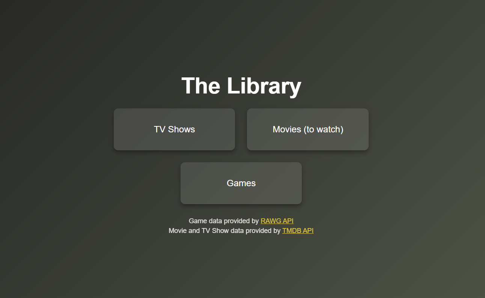

## Games

### Dashboard
*The central hub showing your latest gaming activity, wishlist games and library overview.*
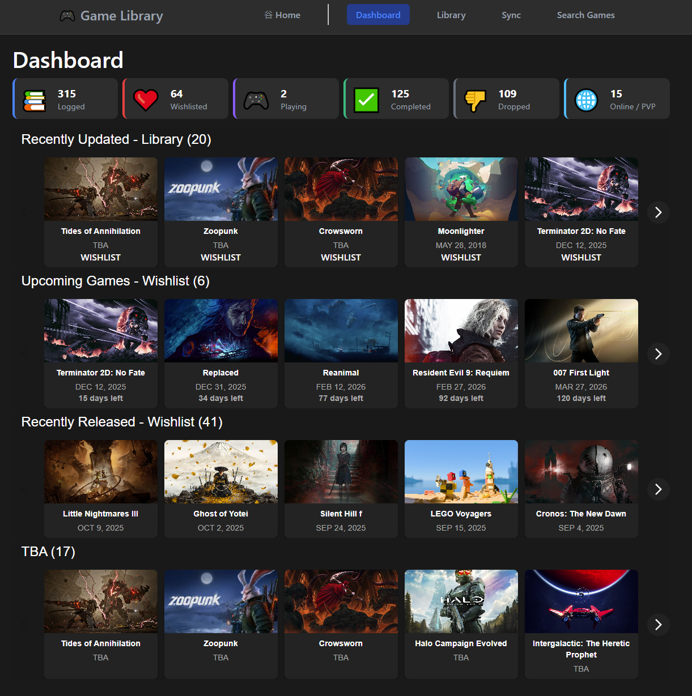

### Library
*Features include a paginated grid view of game cards, status-based filtering and a search bar for quick lookup. User can also edit game logs or remove entries directly from this interface to keep their library up to date.*
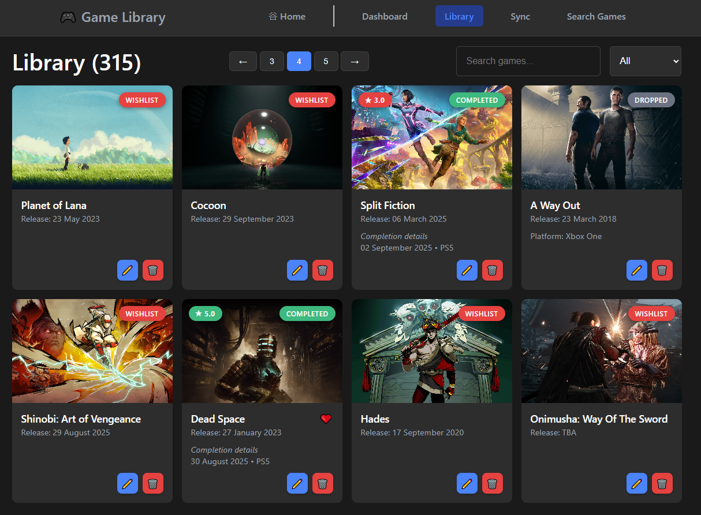

### Sync
*Users can select specific status from a list and trigger a manual sync to update metadata (e.g. release date) from external API. The results are displayed immediately after completion.*
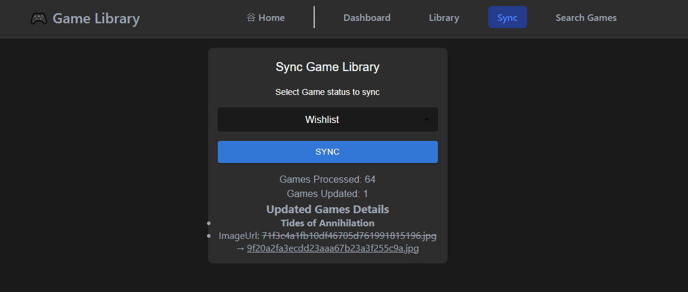

### Search
*A search interface that queries external public API. User can perform one-click actions to instantly add titles to their gamelog or wishlist.*
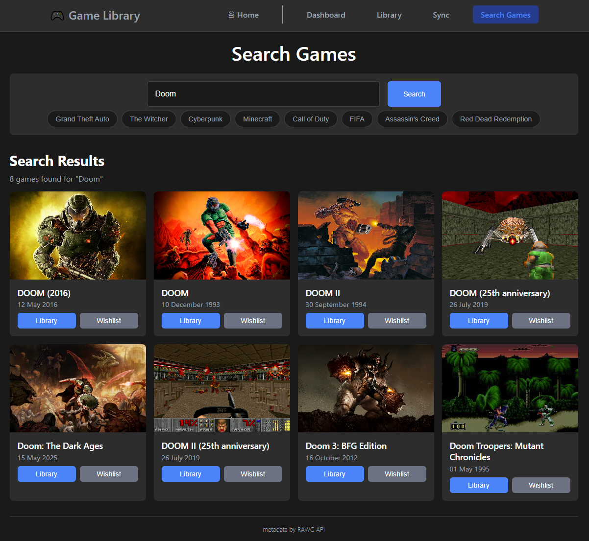

## TV Shows

### Dashboard
*A centralized TV show dashboard featuring search functionality and status-based filtering (Watching, Up-to-Date, Completed, On Hold, Dropped, Wishlist) to organize and track viewing progress.*
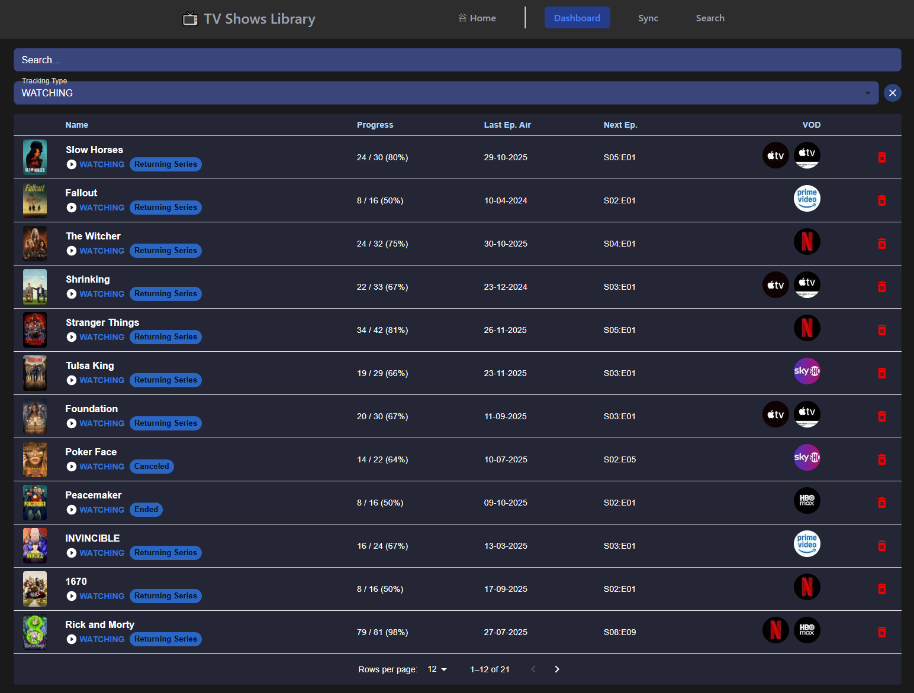

### Details
*A deep-dive view for individual series. Users can update tracking status, rate seasons, and manually set watched counts to keep their progress bar accurate. The page also displays a "Next Episode" countdown and available VOD streaming providers.*
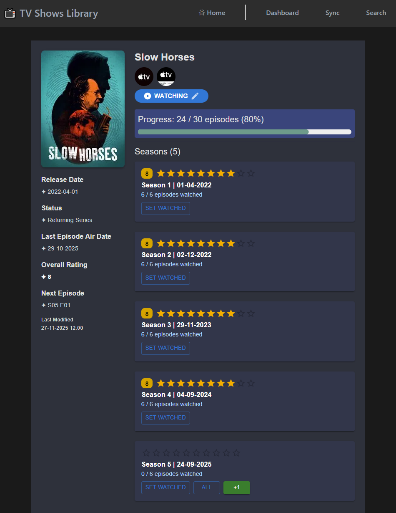

### Sync
*Users can select specific tracking types (e.g., "Watching", "Wishlist") to target for updates. The system then pulls the latest data from external APIs and displays a real-time summary of the sync results, including which records were successfully updated.*
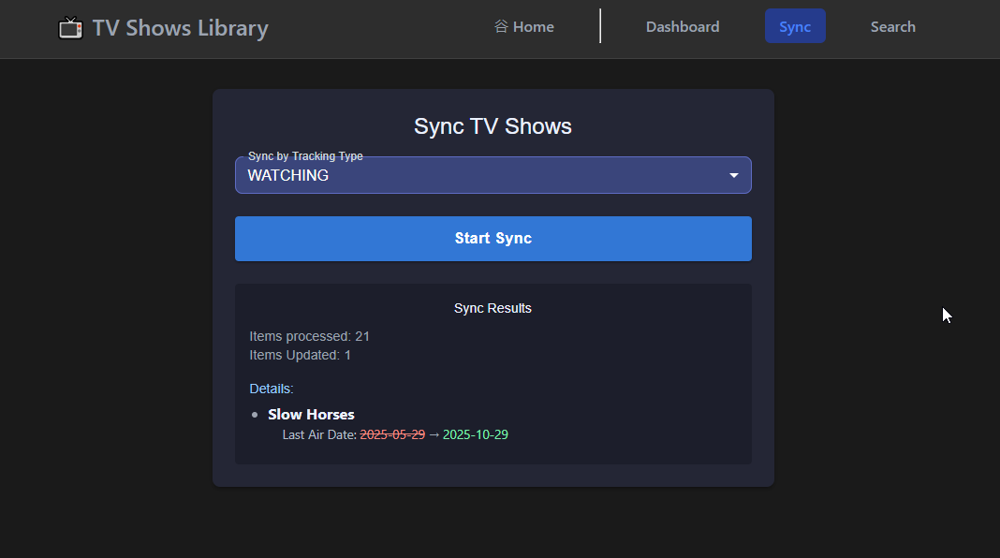

### Search
*The central discovery hub for finding new TV shows. This interface queries the API in real-time, allowing users to browse results and instantly add a series to their personal library or wishlist.*
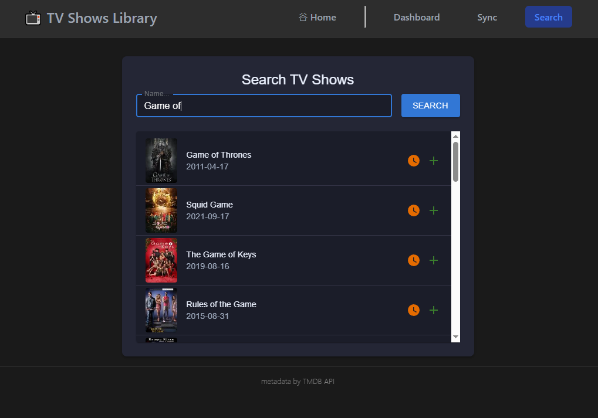

## Movies

### Dashboard
*A centralized Movies dashboard featuring search functionality.*
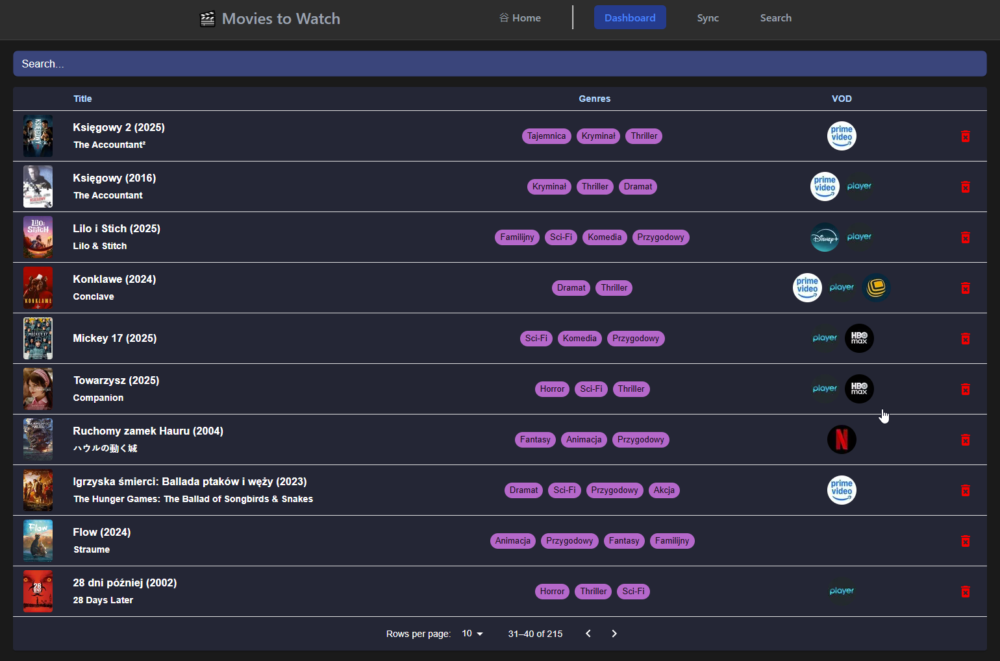

### Details
*A comprehensive overview for individual films. This page displays key metadata, lists available VOD streaming services, and features a manual sync button to ensure release dates are always up to date with external API.*
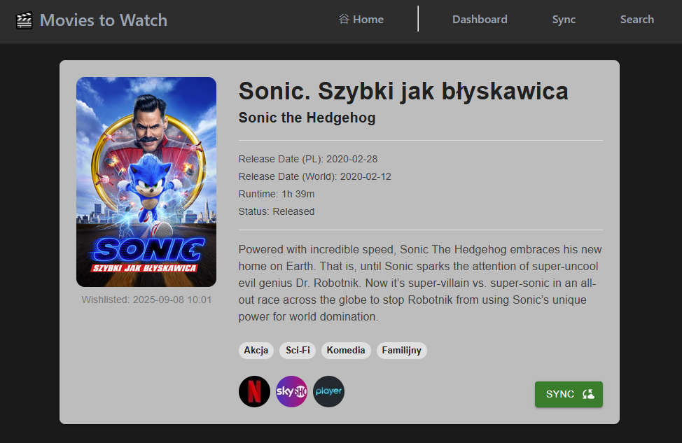

### Sync
*A streamlined interface for refreshing all movie metadata. Users can trigger a one-click bulk synchronization with the API to update release dates, and other information across their entire movies-to-watch library.*
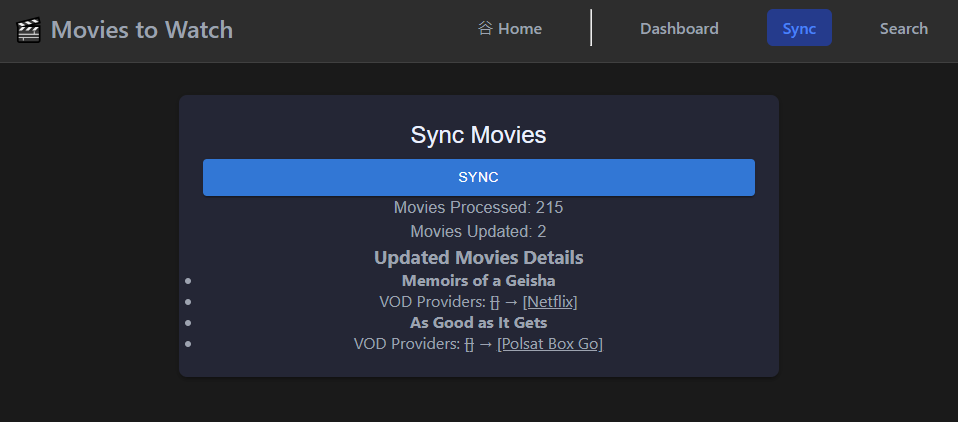

### Search
*A search interface powered by the TMDB API. Users can search for films by title, view quick result cards, and instantly add movies to their 'Wishlist' for future viewing with a single click.*
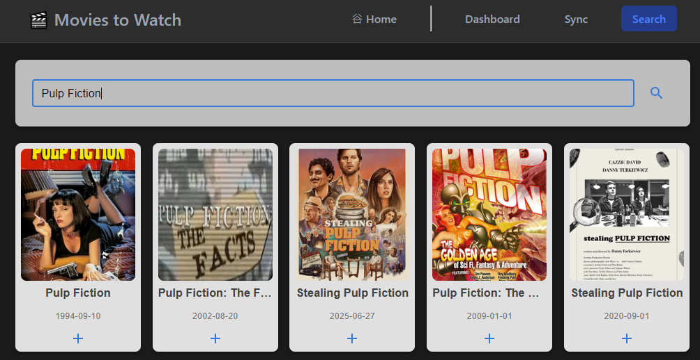